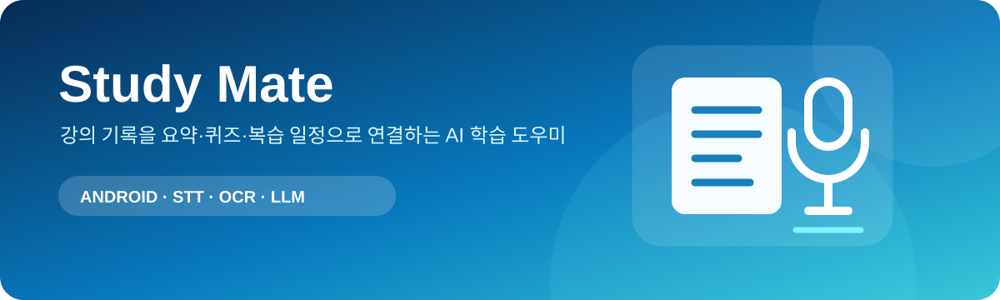
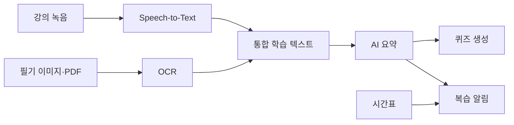

# Study Mate

  

> 강의 녹음과 손글씨 필기를 디지털화하고, AI 요약·퀴즈·복습 알림으로 연결한 모바일 프로그래밍 팀 프로젝트입니다.

## 프로젝트 설명

장시간 강의 녹음에서 핵심 내용을 다시 찾기 어렵고, 태블릿·종이 필기는 검색하기 어렵다는 학습 문제에서 출발했습니다. Study Mate는 음성과 필기 자료를 텍스트로 통합한 뒤 요약과 퀴즈를 생성하고, 시간표 기반 알림으로 복습까지 이어지도록 설계한 Android 학습 보조 앱입니다.

  

## 주요 기능

- 강의 녹음과 오디오 파일 불러오기
- Google Speech-to-Text 기반 음성 변환
- 이미지·PDF 페이지의 Azure OCR
- 녹음문과 필기 텍스트 통합
- LLM 기반 핵심 요약과 객관식 퀴즈 생성
- 개인 시간표 등록과 복습 알림
- 학습 자료의 로컬 저장 및 다시 보기

## 학습 데이터 흐름

## 개발 과정

1. 학습자가 강의 중 기록하고 복습하는 전체 흐름을 정의했습니다.
2. 녹음·파일 선택·시간표 등 Android 기본 화면을 구현했습니다.
3. 긴 음성 파일은 GCS 업로드와 비동기 STT 요청으로 처리하도록 설계했습니다.
4. PDF 페이지를 이미지로 변환하고 OCR 결과를 순차적으로 결합했습니다.
5. 음성문과 OCR 결과를 합쳐 요약하고, 그 결과에서 퀴즈를 생성했습니다.
6. 복습 시점을 놓치지 않도록 시간표와 알림 기능을 연결했습니다.

## 담당 역할

- 팀장으로 프로젝트 계획·설계·일정 조율
- 기능 간 데이터 흐름과 전체 구조 설계
- 핵심 기능 구현과 통합
- 메인 백엔드 및 외부 API 연동 코드 작성

## 기술 구성

| 영역 | 기술 |
|---|---|
| Mobile | Java, Android SDK |
| Speech | Google Speech-to-Text, Google Cloud Storage |
| OCR | Azure Computer Vision |
| AI | OpenAI API |
| Document | PDFBox Android |
| Schedule | Android Alarm / Notification |

## 저장소 범위

보존된 범위는 당시의 `app/src/main` 소스 스냅샷입니다. Gradle 루트 구성은 남아 있지 않아 현재 저장소만으로 완전한 빌드를 보장하지 않습니다. 샘플 Gradle 파일은 필요한 설정 이름과 주요 의존성을 기록하기 위한 참고 자료입니다.

## 프로젝트 범위 및 유의사항

외부 구성요소와 자료의 출처·이용 조건은 [THIRD_PARTY_NOTICES.md](THIRD_PARTY_NOTICES.md)를 참고하세요.

- 모바일 프로그래밍 과목의 팀 프로젝트를 포트폴리오 형태로 보존한 저장소입니다.
- 별도의 오픈소스 라이선스를 부여하지 않았으며 재사용·재배포 허가를 의미하지 않습니다.
- 전체 결과물은 팀 공동 작업이며 담당 역할은 개인 기여 범위를 나타냅니다.
- API 키, 서비스 계정 JSON, 서명 URL, 학습 파일, 사용자 데이터와 팀원 개인 정보는 제외했습니다.
- 서비스 계정과 장기 비밀키는 모바일 앱에 포함하지 않고 서버에서 관리해야 합니다.
- AI 요약·퀴즈와 OCR·STT 결과는 부정확할 수 있으며 학습 결과를 보장하지 않습니다.
- 수업용 프로토타입으로 운영 환경의 보안·비용·장시간 처리 안정성을 검증한 제품이 아닙니다.
